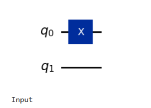

# Exp no 1
## Pauli X Gate
### [Definition]

## Instruction
1.Go to Website :  http://ibm.com/quantum/qiskit


# Code 
```
!pip install qiskit[visualization]
!pip install qiskit-aer
!pip install qiskit-ibm-runtime
!pip install qiskit-Aer
!pip install matplotlib
!pip install numpy
```

```
import qiskit

print(f"Qiskit version: {qiskit.__version__}")
```

```
import qiskit_aer
print(qiskit_aer.__version__)
```

```
from qiskit import QuantumCircuit
from qiskit.quantum_info import Statevector
import matplotlib.pyplot as plt
import numpy as np
# Create a quantum circuit with one qubit
qc = QuantumCircuit(2)
qc.x(0)
#qc.tdg(0)
#qc.sdg(0)
#qc.tdg(0)
#qc.x(1)
#qc.x(0)
#qc.x(1)
#qc.y(0)
#qc.y(1)
#qc.x(0)
#qc.x(1)
#qc.x(0)
# Initial statevector
state1 = Statevector.from_instruction(qc)
print("Initial quantum statevector:")
#print(state1.data)
#!pip install numpy
from qiskit.circuit.instruction import numpy
#import numpy as np
print(np.round(state1.data, 10))
#print(state2.data)
print ("Probability Values")
state1.probabilities()
```

```
# Plot Bloch sphere representation
from qiskit.visualization import plot_bloch_multivector
plot_bloch_multivector(state1)
plt.show()
```

```
from IPython.display import display
display(qc.draw(output='mpl'))
print("Input")
```
Sample Output:



```
#from qiskit import QuantumCircuit
#from qiskit.quantum_info import Statevector
from qiskit.visualization import plot_histogram
from IPython.display import display

# Simulate the state
state = Statevector.from_instruction(qc)

# Sample measurement results
counts = state.sample_counts(shots=1000)

# Display the histogram
display(plot_histogram(counts))
```
